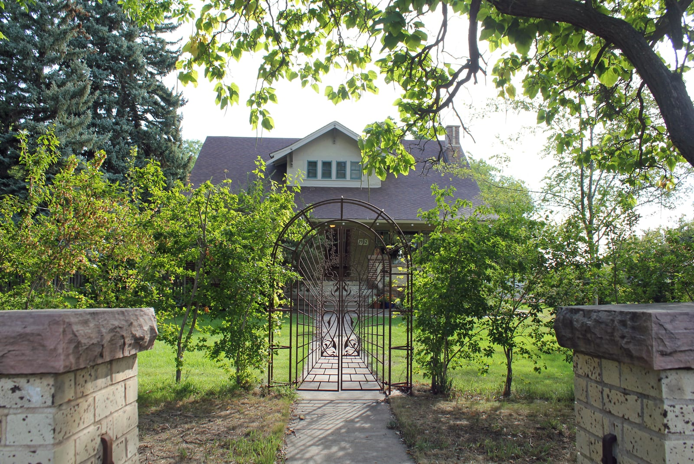

Berthoud exists because of a river crossing. Settlers came into the Little Thompson valley in the early 1860s in the wake of the Colorado gold rush, and in 1872 Lewis Cross, a Central City miner turned rancher, took the first homestead at the spot where the Colorado Central Railroad meant to cross Little Thompson Creek. When the tracks came through in 1877 the railroad put in a depot, a section house and a water tank, and the settlement that grew around them was called Little Thompson. It was renamed for Edward L. Berthoud, the engineer who surveyed the line, and the post office opened under that name on April 4, 1878.

## The town that moved

The river-bottom site was a poor one for steam locomotives, which had to climb out of the valley in both directions, and by the early 1880s the railroad wanted the stop on the bluff a mile north. So in the winter of 1883–84 the town moved: several of its buildings were loaded onto wheels and pulled up the hill by teams of draft animals to the present site. The new grid along Mountain Avenue filled in with brick storefronts, and Berthoud incorporated on August 28, 1888.

The oldest building downtown is from that decade. Alfred G. Bimson built his blacksmith shop of native sandstone in 1893, the first smithy in town, and it stayed open as a smithy until 1943. Residents saved it in 1976, the Berthoud Historical Society opened it as the [Little Thompson Valley Pioneer Museum](/places/pioneer-museum/) in 1978, and it went on the National Register of Historic Places in 1981. The Society's other house, the [McCarty-Fickel Home](/places/mccarty-fickel-home/) on 7th Street, was built in 1916 by Dr. and Mrs. D.W. McCarty in the Denver Square style and still has the doctor's office from the 1930s.

## The Garden Spot

The plains around the town were dry until farmers diverted the Big and Little Thompson rivers into ditches, and irrigated fields of alfalfa, wheat, corn, barley and sugar beets gave Berthoud the name it still puts on its welcome sign: the Garden Spot of Colorado. Sugar beets were the money crop through the first half of the twentieth century. Growers hauled them to rural dumping stations, where they were loaded into boxcars for the factories in Loveland and Longmont; in the 1940s the harvest depended on Mexican migrant workers and German prisoners of war. The farmsteads of that era ring the town, and several, the Salomonson, Swanson-Nibbelink and Lebsack-Ritter farms among them, open their barns on the Historical Society's August tour.

## The highway that left

US 287 was Mountain Avenue's through-traffic for eighty years after it joined the paved state system in the 1920s. In 2007 the highway was rerouted north and west of town, bypassing downtown. The bypass took the trucks off Mountain Avenue and, for a while, some of the customers; what came back a decade later was a Main Street of breweries, galleries, antique malls and murals, and the [downtown association](https://berthoudmainstreet.org/) that now runs the calendar.

## The town that doubled

Berthoud had about 5,000 people in 2010 and 10,332 in the 2020 census (10,071 of them in Larimer County, 261 in Weld). Sales tax from that growth built the [Recreation Center](/places/berthoud-recreation-center/) at Waggener Farm Park, opened in November 2021, and the [bike park](/places/berthoud-bike-park/) that followed in 2023; the Town opened [Berthoud Reservoir](/places/berthoud-reservoir-loop/) to walkers and paddlers in 2020. In 2019 the Board made Berthoud the only municipality in Colorado to ban the retail sale of dogs from puppy mills.

## Sources

- [Berthoud, Colorado](https://en.wikipedia.org/wiki/Berthoud,_Colorado) on Wikipedia: settlement, the 1877 railroad, the 1883–84 move, incorporation, sugar beets, the 2007 bypass, the 2020 census, the 2019 ordinance.
- [Bimson Blacksmith Shop](https://en.wikipedia.org/wiki/Bimson_Blacksmith_Shop) and the [Berthoud Historical Society](https://www.berthoudhistoricalsociety.org/): the 1893 shop, the 1978 museum, the 1981 listing, the McCarty-Fickel Home and the barn tour.
- [KUNC, April 2021](https://www.kunc.org/news/2021-04-22/fast-growing-berthoud-eyes-completion-of-towns-first-recreation-facility): the recreation center and the sales tax that paid for it.
- [Town of Berthoud](https://www.berthoud.org/): the bike park, the reservoir and the parks master plan.
