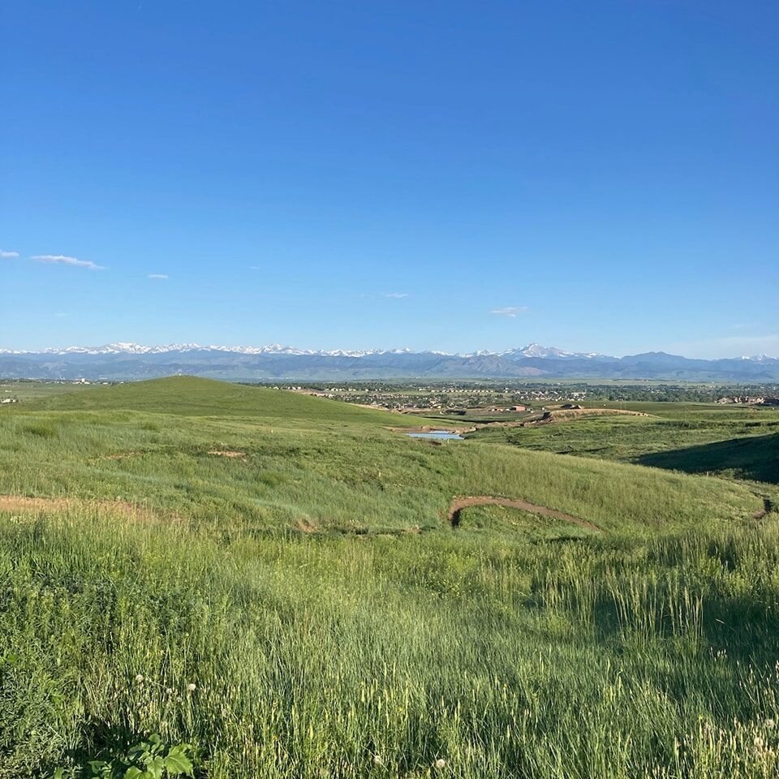
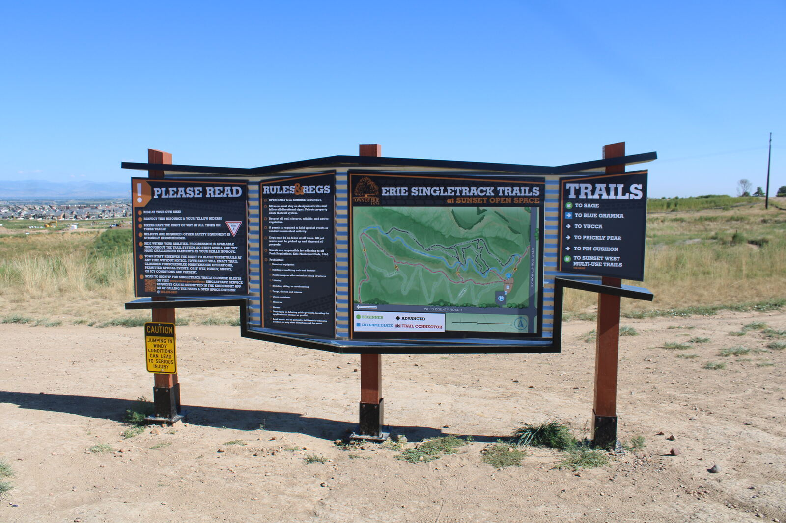

A progression-focused network of 3.15 miles of singletrack on 49.5 acres of Town open space at County Roads 5 and 6 on the north side: rollers, jumps and tabletops on trails marked beginner, intermediate and advanced, with a shelter, parking and seasonal toilets. Multi-use, hikers yield to bikes; Class 1 and 2 e-bikes allowed, Class 3 not; dogs on leash; closed when wet or snowy. Sunrise to sunset.

*Photo: Town of Erie*

*Photo: Town of Erie*
