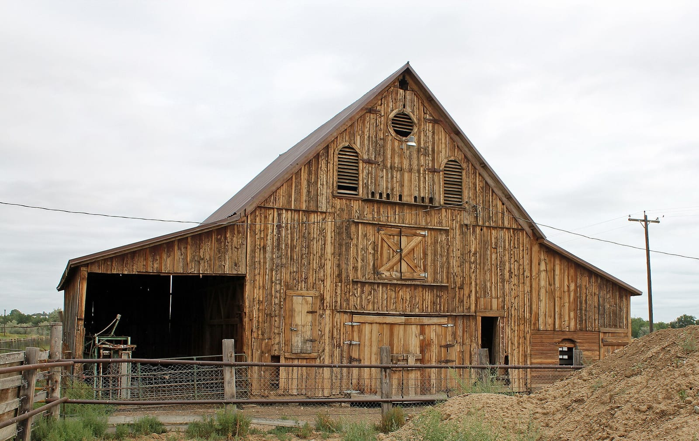
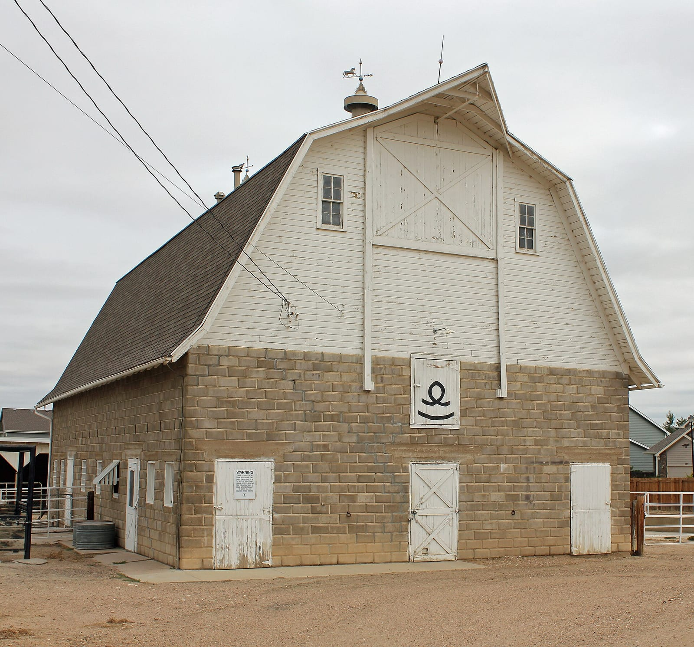

Johnstown exists because Harvey J. Parish read a railroad map. In 1902, knowing the Great Western Railway meant to build through the Little Thompson valley, Parish bought land at eleven dollars an acre and platted a town on it. His seven-year-old son John was in hospital recovering from a ruptured appendix, and by the family's account Parish declared, "It will be my son's town. Let's call it John's Town." Fairbairn & Parish Hardware & Lumber opened that October as the first business; the town incorporated in 1907; and John Parish grew up to serve as mayor from 1929 to 1934. The main street, first called Greeley Avenue Public Road, is Parish Avenue now, and the Craftsman bungalow Harvey and Mary Parish built on Charlotte Street in 1914 is the [Historical Society's museum](/places/parish-house-museum/).

## Two barns on the National Register

Two farm buildings outside town are on the National Register of Historic Places, and the older of them was standing nearly forty years before Parish drew his plat. Jared L. Brush came west in the 1859 gold rush, and in July 1860 he and his brothers William and John gave up mining for homesteads in the Big Thompson valley, cutting the native hay and hauling it to sell in the mining camp at Central City. In 1865 he built a barn to store it: pegged post-and-beam timbers, unpainted board-and-batten siding, a foundation of large stones. It still stands at 24308 County Road 17, about a mile northeast of town, as part of a working farm, and it was listed in 1991 as a rare Weld County barn from before the railroad. Brush sold out to his brother John in 1870 and moved to Greeley, where he presided over the Greeley National Bank, served as county sheriff and state representative, and was twice lieutenant governor of Colorado. The town of Brush in Morgan County is named for him.

*Photo: Jeffrey Beall, Wikimedia Commons, CC BY-SA 3.0*

The second is on Colorado 60 west of town, near Johnstown Reservoir. Albert Anderson came from Sweden in 1912, and in 1913 he built a barn with C. E. "Cement" Carlson and four young Russian immigrants, making its concrete blocks one at a time with a hand mixer; the lumber came from Fred Harsh's Johnstown lumberyard. Its lower floor held draft horses and the family's milk cows under a hay loft, and it became a quarter-horse barn around 1990. Anderson's grandson Melvin Carlson nominated it, and it was listed in 2004 as an intact example of the ornamental concrete block that Colorado builders used from 1900 to 1940.

*Photo: Jeffrey Beall, Wikimedia Commons, CC BY-SA 3.0*

Both barns are on private, working properties and are not open to visitors.

## Sugar town

The town's first decades are the story of two factories. The Mohawk Condensed Milk Company opened in 1910 and ran for 66 years. The Great Western Sugar Company started a factory on Colorado 60 between Johnstown and Milliken in 1920 and completed it as a refinery in 1926, and for the next 75 years the beet wagons and then the trucks came up Parish Avenue every autumn. In its last years the plant ran as Colorado Sweet Gold, making molasses products; the equipment was auctioned and the building came down in the autumn of 2005. The Historical Society marked the factory's centenary in 2026. The [walking tour](/places/old-town-walking-tour/) passes the survivors of those years: the 1904 Union High School, the 1904 Methodist Episcopal church, the First Baptist Church of 1908–09, the 1922 high school used until 1967 and the 1928 Masonic Temple, and the site of the Giesler Opera House, built in 1914 and pulled down in 1935.

## The meteorite

On the afternoon of July 6, 1924, about two hundred mourners at a funeral at the Dilley Chapel in Elwell, the farm hamlet next to Johnstown, heard four explosions and watched a fiery object with a smoke trail come down out of the sky. A neighbor dug the first fragment, just under twelve pounds, out of the ground while the service went on; a farmer named George Walker found the main mass a week later, nearly 52 pounds and six feet deep. Twenty-seven pieces were recovered across ten miles toward Mead. The Johnstown meteorite is a diogenite, a piece of the asteroid Vesta about as old as the Earth, one of only five meteorites ever seen to fall in Colorado; the main mass is at the American Museum of Natural History in New York, and a small piece is in the Parish House.

## Boomtown

Johnstown was a farm and factory town of a few thousand people for most of a century, and its population was 9,887 in 2010. Then the interchange at I-25 and US 34, branded 2534, filled in: Scheels opened its 250,000-square-foot store there in September 2017 and became the town's largest employer, the Candlelight Dinner Playhouse and Johnstown Plaza grew up around it, and in March 2024 Colorado's first Buc-ee's opened at I-25 and County Road 48. The 2020 census counted 17,303 people; the Census Bureau's estimate for July 2025 was 22,433, an 8.4 percent rise in a single year that ranked Johnstown tenth in the nation for growth among places of 20,000 or more. The town adopted a home-rule charter in 2006 to manage it, and created a Downtown Development Authority in 2026 to make sure Old Town keeps up.

## Sources

- [Johnstown, Colorado](https://en.wikipedia.org/wiki/Johnstown,_Colorado) on Wikipedia: Parish, the 1902 plat and 1907 incorporation, the naming, John Parish's mayoralty, the 2010 and 2020 counts, employers.
- [Johnstown Historical Society](https://jhsco.org/): the Parish House, the [walking tour](https://jhsco.org/historicwalkingtour/) with its building dates, the meteorite fragment and the 2026 sugar-factory centenary.
- National Register nominations for the [Jared L. Brush Barn](https://npgallery.nps.gov/pdfhost/docs/NRHP/Text/91001532.pdf) (R. Laurie and Thomas H. Simmons) and the [Anderson Barn](https://npgallery.nps.gov/NRHP/GetAsset/NRHP/04001112_text) (Phyllis Carlson Bender and Melvin Carlson, 2004): the barns' dates, builders, construction and uses, and Brush's career. Listing years from Wikipedia's articles on the [Brush](https://en.wikipedia.org/wiki/Jared_L._Brush_Barn) and [Anderson](https://en.wikipedia.org/wiki/Anderson_Barn_(Johnstown,_Colorado)) barns.
- [UCHealth Today](https://www.uchealth.org/today/johnstown-meteorite-disrupts-funeral-in-1924/): the meteorite fall and its pieces.
- [BizWest, October 2005](https://bizwest.com/2005/10/28/johnstown-witnesses-end-of-era-as-sugar-factory-comes-down/) and [Fort Collins Images](https://fortcollinsimages.wordpress.com/2019/09/09/the-johnstown-colorado-sugar-beet-facility/): the sugar factory's 1920–26 construction, 75 years of production and 2005 demolition.
- [KUNC and BizWest, May 2026](https://www.kunc.org/news/2026-05-18/from-buc-ees-to-boomtown-johnstowns-growth-goes-national) and [K99](https://k99.com/johnstown-population-growth/): the 2025 estimate and the growth ranking.
- [Colorado Public Radio, March 2024](https://www.cpr.org/2024/03/18/first-colorado-buc-ees-location-is-now-open-in-johnstown-on-i25/): Buc-ee's opening.
