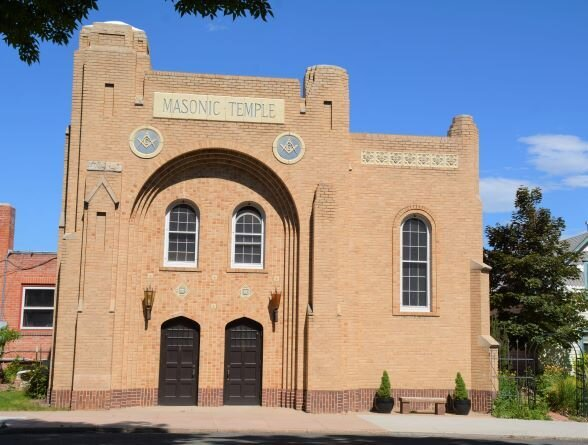
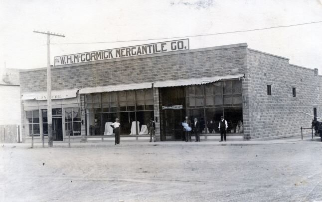

A self-guided tour of 25 numbered stops through Old Town Johnstown, starting at the Parish House: Fairbairn & Parish Hardware & Lumber, the town's first business (October 1902), now the Senior Center; the 1904 Union High School and the 1922 high school used until 1967; the 1904 Methodist Episcopal church, now the Hope Center; the First Baptist Church (1908–09); the 1928 Masonic Temple, now a residence; the W.H. McCormick Mercantile Co. at 1 N Parish; the site of the 1914 Giesler Opera House; and the Mohawk Condensed Milk plant that ran for 66 years from 1910. Many of the stops are private homes, so the Society asks walkers to keep to the public sidewalk. Ask the Society for the map.

*Photo: Courtesy of the Johnstown Historical Society, Ltd*

*Photo: Courtesy of the Johnstown Historical Society, Ltd*
